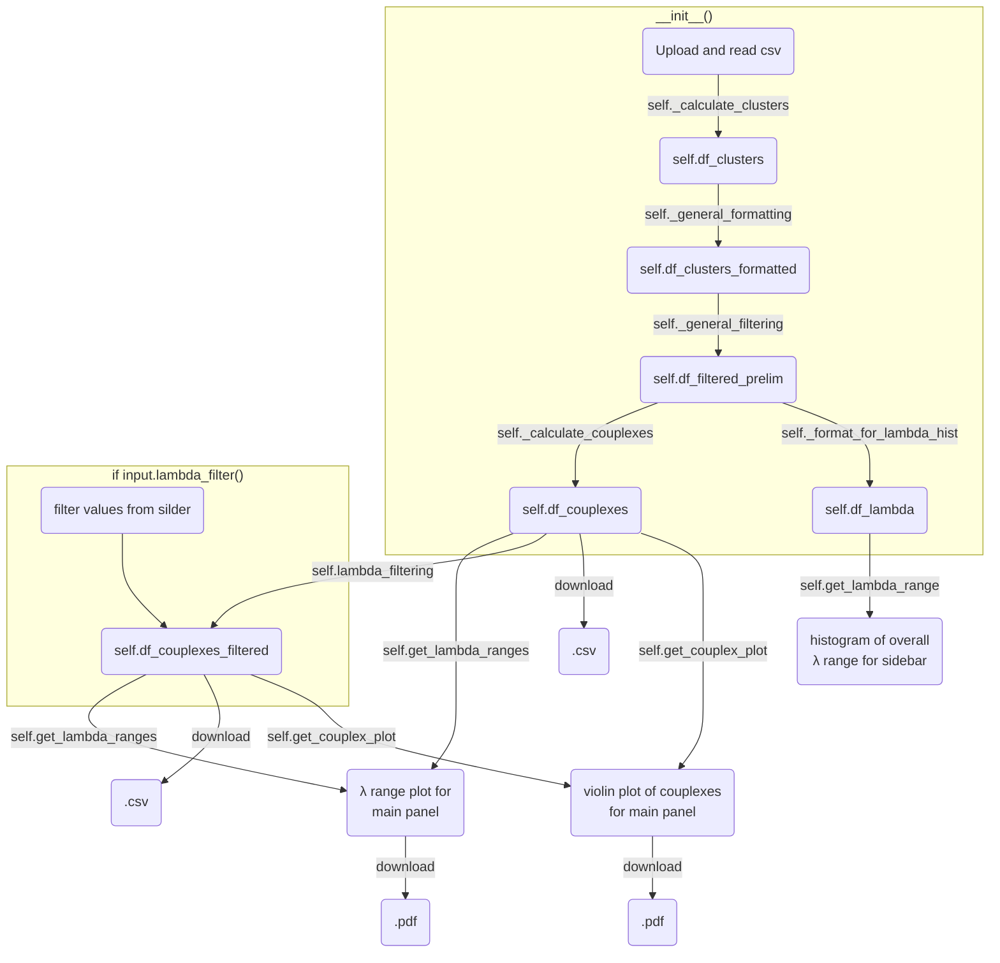

# Calculation of couplexes from PICO experiments

- compatible with QIAcuity Software Suite 2.5.0.1 only
- sample names containing NTC will be removed
- supported Nanoplate formats 8.5k (use 13µl master mix) and 26k (use 42µl master mix)
- clusters with 0 counts are removed


*more information on usage will follow*

[App on shinyapps.io](https://thundert.shinyapps.io/calculate_couplexes/)


---

### How the PICO class is initialized, what its functions do and how the data frames are handled


### to dos
- ```cluster_calculation.py``` still runs with pandas, while the rest runs with polars. This necessiates the conversion of dataframe types at some points.
- 