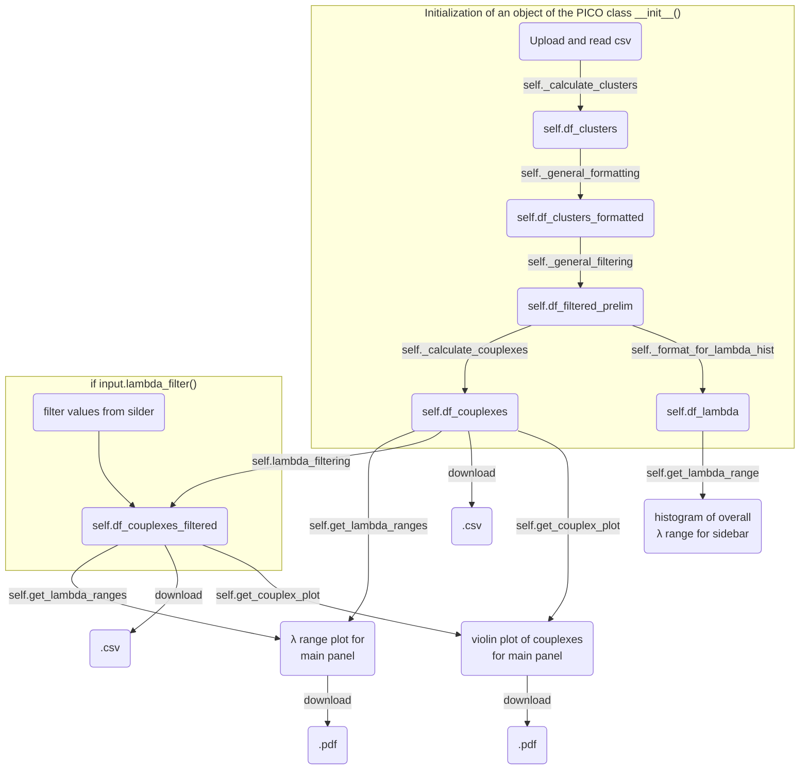

# Calculation of couplexes from PICO experiments

- compatible with QIAcuity Software Suite 2.5.0.1 only
- sample names containing NTC will be removed
- supported Nanoplate formats 8.5k (use 13µl master mix) and 26k (use 42µl master mix)
- clusters with 0 counts are removed
- specify antibody names as target names of the reaction mix, avoid "," in the antibody name


[App on shinyapps.io](https://thundert.shinyapps.io/calculate_couplexes/)

developed with ```shiny``` for ```python```, ```plotnine``` and ```polars```

---

### How the PICO class is initialized, what its functions do and how the data frames are handled


### to dos
#### soon
- Update ```README.md``` and the ```ui.py``` with instructions on usage and what the app does.
- Display table with mean and SD of the currently shown groups in the violin plots of the number of couplexes.

#### sooner or later
- Implement panel for preparatory calculations for experimental procedure and then generate a .pdf output with the instructions. However, markdown to pdf is not yet available for pyhton [or at least I couldn't come up with a solution](https://forum.posit.co/t/shiny-for-python-downloadable-report/181461). Thus, this might necessitate the usage of ```R``` or ```reticulate``` or this will simply become a separate app.
- ```cluster_calculation.py``` still runs with ```pandas```, while the rest runs with ```polars```. This necessiates the conversion of dataframe types at some points. Harmonize this issue by consistently using ```polars```.
- Enable upload of multiple files and their processing.
- Enable upload of files from other dPCR systems such as naica from Stilla.
- Enable custom clustering (or thresholding) for very raw data to generate suitable 2-dimensional dPCR data from monochrom multiplexing, for instance, by implementing interactive plots with ```plotly``` and lasso-selection or by using [```ddPCRclust``` package](https://github.com/bgbrink/ddPCRclust), which is ```R``` based.
- Enable absolute quantification based on the couplex counts. However, under saturated conditions the couplex concentration equals the antigen concentration ([Gross *et al.* 2024](https://www.biorxiv.org/content/10.1101/2024.03.19.585761v2))