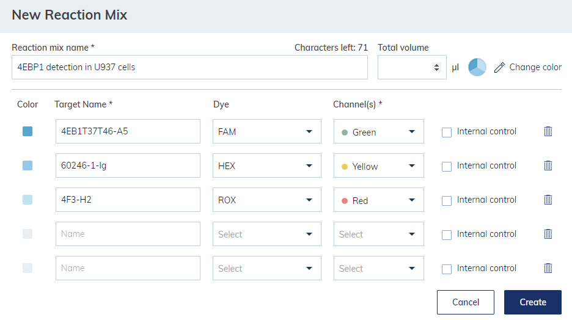
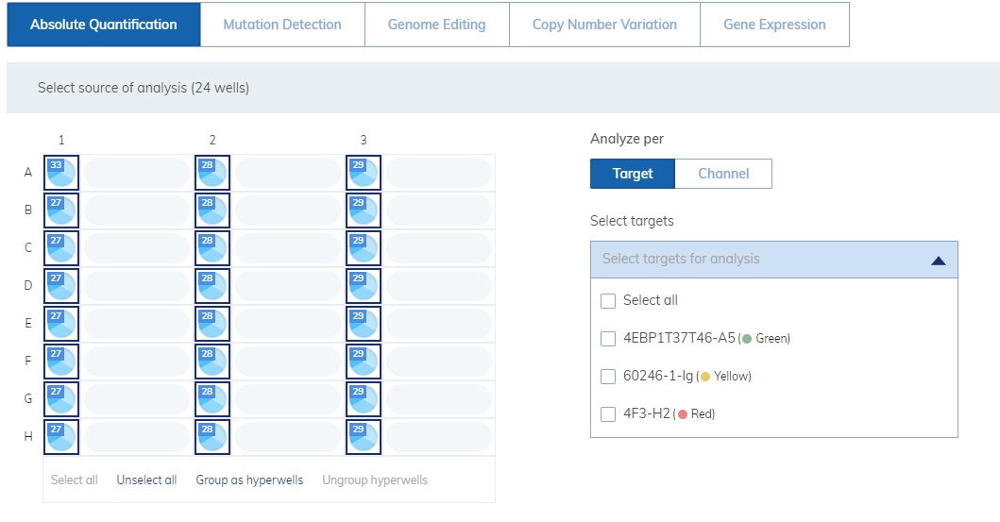
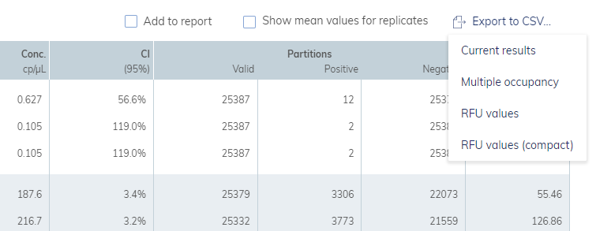
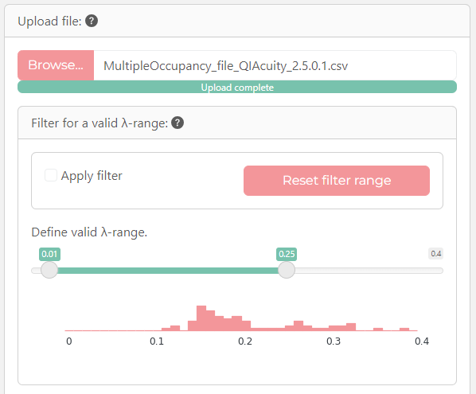
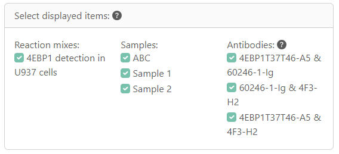
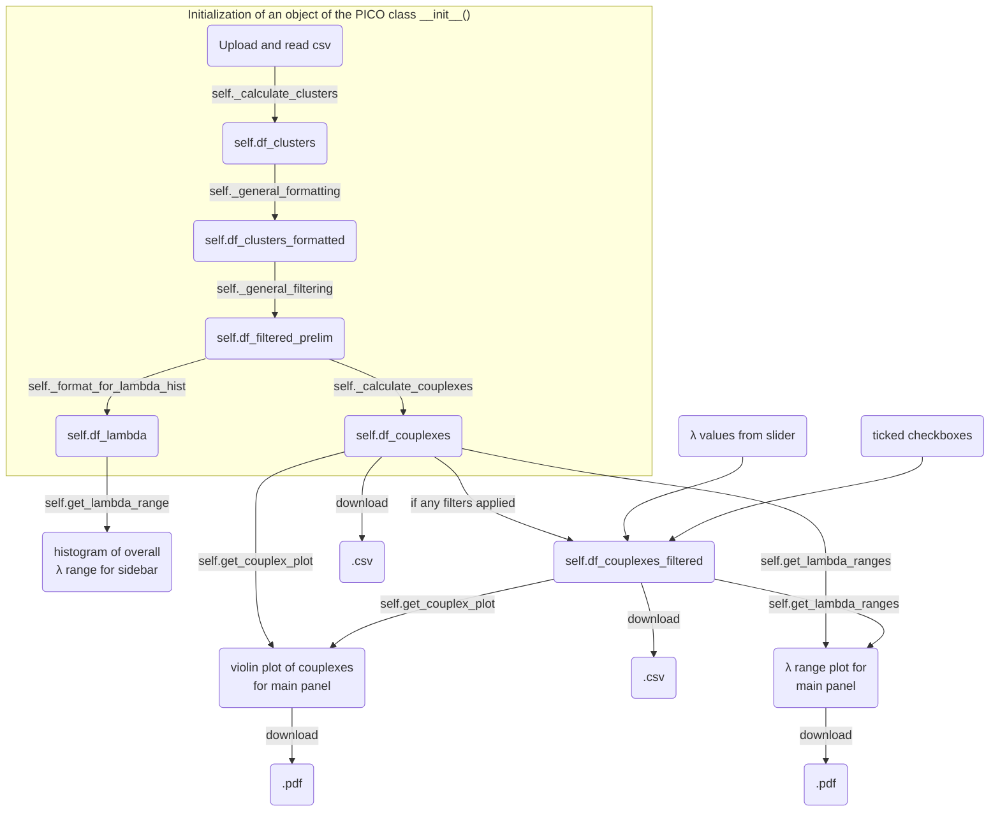

# Evaluation of PICO experiments

[](https://thundert.shinyapps.io/calculate_couplexes/)

Developed with [```shiny``` for ```python```](https://shiny.posit.co/py/), [```plotnine```](https://plotnine.org/) and [```polars```](https://pola.rs/).

## Goal
This app shall allow you to evaluate your PICO experiments in a simple and straight forward manner.

## Background
Protein Interaction Coupling (PICO) is a homogeneous, digital immunoassay based on at least two DNA-labeled antibodies for protein-to-nucleic acids transformation and dPCR. Sample and DNA-labeled antibodies are combined in the binding reaction and incubated overnight, where antibodies bind their targets. The formed ternary complexes (two antibodies and one target) are called couplexes and represent the measurement unit of a PICO assay.

## Requirements
Obviously, before using this app you would need to produce data in your lab. If you just want to play around with the app, you can use the data in [examples/](https://github.com/LangeTo/calculations-pico/tree/master/examples).\
At the current state, you need to pay attention to some details: 

- The app is compatible only with the MultipleOccupancy file from the QIAcuity Software Suite 2.5.0.1.
- Nanoplate formats 8.5k and 26k are currently supported. It is recommended to use **13 µl** reaction mix for 8.5k Nanoplates and **42 µl** for 26k Nanoplates because these are the hardcoded values in ```self._general_formatting()```. For further plate formats or other volumes, the dictionary ```qiacuity_info``` should be adjusted.
- In ```self._general_filtering()``` samples containing the string "NTC" as well as clusters with 0 counts are removed. This is a precautionary measure since this might break the calculation of the number of couplexes with ```couplexes_calculation.py``` wrapped by ```self._calculate_couplexes()```.
- To correctly display the antibody names, they should be defined as the targets of the reaction mix in the QIAcuity Software Suite ([see below](#usage)). Avoid the usage of "," in the antibodies names. I would suggest to use the clone of the antibodies because these are unique identifiers. 

## Usage
1. Before the dPCR run on the QIAcuity dPCR system, you need to define a plate. Use this chance to set some parameters directly to what you want to see later in the app. The reaction mix as well as the target names will be displayed in the filter masks of PICO evaluation app.\
    
2. After the dPCR run, in the "Absolute Quantification" tab, select all samples and all targets.\
    
3. Then, in the "List" tab, navigate to "Export to CSV..." and select "Multiple occupancy".\
   
4. After uploading the file to the [app](https://thundert.shinyapps.io/calculate_couplexes/), a violin plot of the number of couplexes will be displayed in the first tab and in a second tab a plot with the λ-ranges will be displayed. Furthermore, a histogram of the overall λ range is displayed in the sidebar. 
5. The histogram can be used to apply a λ-filter since values above **0.25** are not recommended ([see my PhD thesis for more details on this](https://1drv.ms/b/c/2a1889c160a8e931/EYiHWqkN2QhEjIzN7Rnpd4YBWR9q-ZLcolZ1zigEUPR4PA?e=8DBu0w)).\
   
6. Further control elements allow you to display the experimental groups or antibodies that you are interested in.\
   
7. Finally, you can download filtered and unfiltered dataframes of the plots as .csv files and the plots as .pdf files.

<!-- ## Downloads
columns of the dataframe ... -->

---

## Details
Here are some details of how the ```python``` code runs.

### Initialization of the PICO class



## To dos
### soon
- Display table with mean and SD of the currently shown groups in the violin plots of the number of couplexes.
- Adjust theme colors to viridis using [this approach](https://shiny.posit.co/r/getstarted/build-an-app/customizing-ui/theming.html).

### sooner or later
- Implement panel for preparatory calculations for experimental procedure and then generate a .pdf output with the instructions. However, markdown to pdf is not yet available for pyhton [or at least I couldn't come up with a solution](https://forum.posit.co/t/shiny-for-python-downloadable-report/181461). Thus, this might necessitate the usage of ```R``` or ```reticulate``` or this will simply become a separate app with ````Quarto```, for instance.
- ```cluster_calculation.py``` still runs with ```pandas```, while the rest runs with ```polars```. This necessiates the conversion of dataframe types at some points. Harmonize this issue by consistently using ```polars```.
- Enable upload of multiple files and their processing.
  - Each file may generate an object of the class PICO, a checkbox_group element can then allow to chose the results from the uploaded files for display.
  - This would require rewriting donwload functions because only down .csv file and one plot shall be generated and supplied for download.
- Enable upload of files from other dPCR systems such as naica from Stilla.
- Enable custom clustering (or thresholding) for very raw data to generate suitable 2-dimensional dPCR data from monochrom multiplexing, for instance, by implementing interactive plots with ```plotly``` and lasso-selection or by using [```ddPCRclust``` package](https://github.com/bgbrink/ddPCRclust), which is ```R``` based.
- Enable absolute quantification based on the couplex counts. However, under saturated conditions the couplex concentration equals the antigen concentration ([Gross *et al.* 2024](https://www.biorxiv.org/content/10.1101/2024.03.19.585761v2)).