# Calculation of couplexes from PICO experiments

compatible with QIAcuity Software Suite 2.5.0.1

*more information on usage will follow*

[App on shinyapps.io](https://thundert.shinyapps.io/calculate_couplexes/)


---

```mermaid
graph TD;
    A(Upload and read csv)-->|_calculate_clusters|B(self.df_clusters);
    B-->|_general_formatting|C(self.df_clusters_formatted);
    C-->|_general_filtering|D(self.df_filtered1);
    D-->|_format_for_lambda|E(self.df_lambda);
    E-->|get_lambda_range|F(histogram of overall λ range);
    D-->|_calculate_couplexes|H(self.df_couplexes);

```



<!-- (re)deploying the app

```powershell
rsconnect deploy shiny C:\Users\tl100\PycharmProjects\shiny_amulator --name thundert --title calculate_couplexes
``` -->

<!-- rename git repository
* disconnect from remote ```git remote rm origin```
* add the new remote branch ```git remote add origin https://github.com/LangeTo/calculations-pico.git```
* then set upstream branch ```git push --set-upstream origin master``` -->

<!-- might also be interesting instead of shiny: https://docs.bokeh.org/en/latest/index.html#  -->